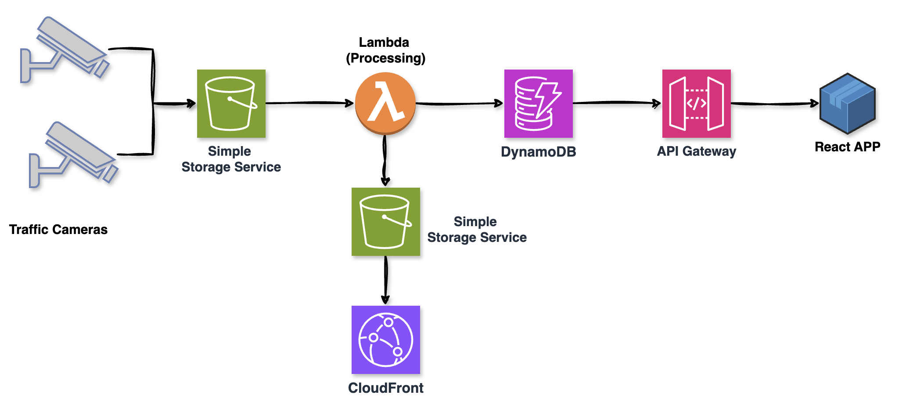

# AI Traffic Safety Analyzer on AWS

Computer vision pipeline for vehicle detection, speed estimation, and traffic safety analytics using AWS serverless architecture.

## Architecture



## Features

- Vehicle detection using YOLO
- Speed estimation from traffic camera footage
- License plate anonymization (GDPR compliant)
- Real-time analytics dashboard
- Traffic violation heatmaps
- Serverless AWS architecture

## Tech Stack

**Infrastructure:**
- Terraform (IaC)
- AWS S3 (storage)
- AWS Lambda (compute)
- Amazon DynamoDB (database)
- API Gateway (REST API)
- CloudFront (CDN)

**ML/AI:**
- YOLOv8 (vehicle detection)
- OpenCV (video processing)
- Custom speed estimation algorithm

**Frontend:**
- React
- Recharts (analytics)
- Leaflet (heatmaps)

## Dataset

Using [BrnoCompSpeed dataset](https://github.com/JakubSochor/BrnoCompSpeed) from Brno University of Technology:
- 18 Full-HD videos (~1 hour each)
- 20,865 annotated vehicles
- Ground truth speed from LIDAR
- Camera calibration data

## Project Structure

```
.
├── terraform/
│   ├── main.tf
│   ├── variables.tf
│   ├── outputs.tf
│   └── modules/
│       ├── s3/
│       ├── lambda/
│       ├── dynamodb/
│       ├── api-gateway/
│       └── cloudfront/
├── lambda/
│   ├── video-processor/
│   ├── speed-estimator/
│   └── api-handler/
├── dashboard/
│   ├── src/
│   └── public/
├── scripts/
│   └── deploy.sh
└── README.md
```

## Prerequisites

- AWS Account
- Terraform >= 1.0
- Python 3.11
- Node.js >= 18
- AWS CLI configured

## Deployment

### Quick Start (Automated)

The easiest way to deploy the entire project:

```bash
# 1. Configure AWS credentials
aws configure

# 2. Run the automated deployment script
bash scripts/deploy.sh
```

This script will:
- Build Lambda functions
- Deploy infrastructure with Terraform
- **Automatically seed 200 demo records into DynamoDB**
- Build and deploy the React dashboard
- Output all important endpoints

The dashboard will be populated with realistic demo data immediately after deployment!

### Manual Deployment

If you prefer to deploy step by step:

#### 1. Build Lambda Functions

```bash
cd lambda
bash build.sh
cd ..
```

#### 2. Deploy Infrastructure with Terraform

```bash
cd terraform

# Copy and edit variables
cp terraform.tfvars.example terraform.tfvars
# Edit terraform.tfvars with your AWS region and preferences

# Initialize and deploy
terraform init
terraform plan
terraform apply

# Save outputs
terraform output > outputs.txt
cd ..
```

#### 3. Build and Deploy Dashboard

```bash
cd dashboard

# Install dependencies
npm install

# Create .env file with API endpoint from Terraform output
echo "VITE_API_ENDPOINT=<your-api-endpoint>" > .env

# Build
npm run build

# Deploy to S3
aws s3 sync build/ s3://traffic-speed-analyzer-dashboard-dev/ --delete

cd ..
```

#### 4. Upload Test Video

```bash
# Get bucket name from Terraform output
aws s3 cp your-video.mp4 s3://traffic-speed-analyzer-videos-dev/
```

### Cleanup

To destroy all resources:

```bash
bash scripts/destroy.sh
```

Or manually:

```bash
cd terraform
terraform destroy
cd ..
```

## Usage

### 1. Access the Dashboard

After deployment, open the CloudFront URL (from Terraform output):

```bash
cd terraform
terraform output dashboard_url
```

### 2. Upload Video for Processing

Upload a video to trigger automatic processing:

```bash
aws s3 cp test-video.mp4 s3://traffic-speed-analyzer-videos-dev/
```

The Lambda function will automatically:
- Detect vehicles in the video
- Estimate speeds
- Store results in DynamoDB
- Generate heatmap data

### 3. View Results

Open the dashboard in your browser to see:
- Real-time statistics (total vehicles, average speed, violations)
- Speed distribution charts
- Vehicle type breakdown
- Traffic heatmap on the map

### 4. Query API Directly

You can also query the API directly:

```bash
# Get all results
curl https://your-api-endpoint.execute-api.eu-west-1.amazonaws.com/dev/results

# Filter by location
curl "https://your-api-endpoint/dev/results?location=brno-location-1"

# Filter by video ID
curl "https://your-api-endpoint/dev/results?videoId=session-001.mp4"
```

## Cost Estimation

For demo/article purposes (~10 videos):
- S3: ~$1-2/month
- Lambda: ~$5-10/month
- DynamoDB: Free tier
- API Gateway: Free tier
- CloudFront: Free tier

**Total: ~$5-15/month**

## Architecture Decisions

1. **Serverless** - No server management, pay per use
2. **S3 Events** - Trigger processing automatically
3. **Lambda Layers** - Share dependencies (OpenCV, YOLO)
4. **DynamoDB** - Fast queries, no provisioning
5. **CloudFront** - Global CDN for dashboard

## Performance

- Video processing: ~2-5 min for 1-hour video
- Speed estimation accuracy: ~1 km/h error (based on BrnoCompSpeed benchmark)
- API response time: <100ms
- Dashboard load time: <2s

## Development

### Local Dashboard Development

```bash
cd dashboard
npm install
npm run dev
```

The dashboard will run on `http://localhost:5173` with hot reload.

### Testing Lambda Functions Locally

```bash
# Test API handler
cd lambda/api-handler
python handler.py

# Test video processor (requires test video)
cd lambda/video-processor
python handler.py
```

### View Lambda Logs

```bash
# Video processor logs
aws logs tail /aws/lambda/traffic-speed-analyzer-video-processor-dev --follow

# API handler logs
aws logs tail /aws/lambda/traffic-speed-analyzer-api-handler-dev --follow
```

## Troubleshooting

### Lambda Timeout
If video processing times out, increase timeout in `terraform/modules/lambda/main.tf`:
```hcl
timeout = 900  # Increase if needed
```

### S3 Bucket Already Exists
If deployment fails due to existing bucket names, modify `project_name` in `terraform.tfvars`:
```hcl
project_name = "traffic-speed-analyzer-yourname"
```

### Dashboard Not Loading
1. Check CloudFront distribution status: `aws cloudfront list-distributions`
2. Verify S3 bucket policy allows public read
3. Check browser console for CORS errors

### No Results in Dashboard
1. Verify video was uploaded to correct bucket
2. Check Lambda execution logs
3. Verify DynamoDB table has data: `aws dynamodb scan --table-name traffic-speed-analyzer-results-dev`

## Future Enhancements

- Real YOLOv8 integration (currently using mock detection)
- SageMaker for model training
- Real-time streaming with Kinesis
- Multi-camera tracking
- License plate recognition (with anonymization)
- Alert system (SNS/SES)
- WebSocket support for real-time updates

## License

MIT

## Author

Roman Ceresnak
AWS Community Builder | ML Engineer
